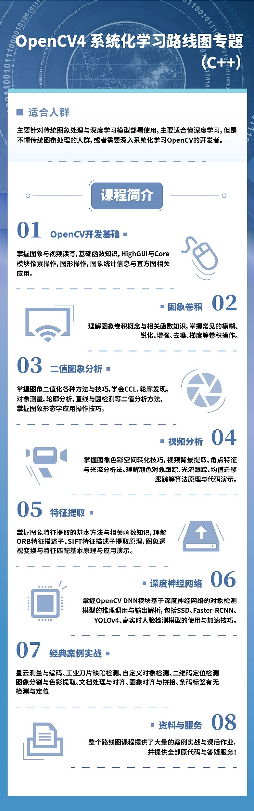

## OpenCV 4.0 C++/python SDK tutorial
- include dnn module code example
- very useful case study
- not only for beginer but also for expericence developer
- include most opencv modules and API usages.
- data 包含演示图像与深度学习模型
- 新增目录Python，添加了OpenCV Python语言教程

## B站免费看！OpenCV C++ 30讲视频课程
https://www.bilibili.com/video/BV1i54y1m7tw

## 贾志刚
2004毕业于山东大学齐鲁软件学院，软件工程专业。主要专注于图像处理算法学习与研究，计算机视觉技术应用开发，深度学习在计算机视觉领域应用。两本书籍《Java数字图像处理-编程技巧与应用实践》、《OpenCV Android开发实战》作者、OpenCV开发专家，OpenCV学堂微信公众号号主、专注图像处理与计算机视觉领域研究与开发多年、专业技术博客访问量超过500万次、精通OpenCV、ImageJ开源框架、图像对象检测与识别等应用开发技术。在对象检测、医学细胞检测与识别、文本处理、图像搜索、人脸美化算法方面有深入研究、开发过多个图像处理算法模块并成功应用在医学检测与工业领域。线下培训人次超过上千人次，主要培训对象为高职院校老师与研究生，企业中高级开发技术人员！

## 视频课程

| 课程名称        | 语言          | 地址         |
| ------------- |:-------------:| :-------------:|
| CV开发工程师全栈技术路线图专题|C++/Python| https://ke.qq.com/course/package/38161 |
| OpenCV4系统化学习路线图 | C++| https://ke.qq.com/course/package/38162 |
| Pytorch框架CV开发-从入门到实战| Python| https://ke.qq.com/course/3520688 |
| OpenCV4 图像处理与视频分析实战教程| C++| https://ke.qq.com/course/3547985 |
|YOLOv5自定义对象检测-从训练到模型部署|Python/c++|https://ke.qq.com/course/3417367|
| Tensorflow Object Detection API对象检测教程| Python| https://ke.qq.com/course/3417426 |
| OpenVINO计算机视觉模型加速教程| c++/Python| https://ke.qq.com/course/3417485 |

### OpenCV4 系统化学习路线图专题（C++）
- <b>OpenCV开发基础</b> 
掌握图象与视频读写，基础函数知识，HighGUI与Core模块像素操作，图形操作，图象统计信息与直方图相关应用。
- <b>图象卷积</b> 
理解图象卷积概念与相关函数知识，掌握常见的模糊、锐化、增强、去噪、梯度等卷积操作
- <b>二值图象分析</b> 
掌握图象二值化各种方法与技巧，学会CCL，轮廓发现，对象测量，轮廓分析，直线与圆检测等二值分析方法，掌握图象形态学应用操作技巧
- <b>视频分析</b> 
掌握图象色彩空间转化技巧，视频背景提取、角点特征与光流分析法、理解颜色对象跟踪、光流跟踪、均值迁移跟踪等算法原理与代码演示
- <b>特征提取</b> 
掌握图象特征提取的基本方法与相关函数知识，理解ORB特征描述子、SIFT特征描述子提取原理，图象透视变换与特征匹配基本原理与应用演示
- <b>深度神经网络</b> 
掌握OpenCV DNN模块基于深度神经网络的对象检测模型的推理调用与输出解析，包括SSD、Faster-RCNN、YOLOv4、高实时人脸检测模型的使用与加速技巧。
- <b>经典案例实战</b> 
星云测量与编码、工业刀片缺陷检测、自定义对象检测、二维码定位检测
图像分割与色彩提取、文档处理与对齐、图象对齐与拼接、条码标签有无检测与定位
- <b>资料与服务</b> 
整个路线图课程提供了大量的案例实战与课后作业，并提供全部原代码与答疑服务！

- <b>适合人群：</b> 
主要针对传统图象处理与深度学习模型部署使用，主要适合懂深度学习，但是不懂传统图象处理的人群，或者需要深入系统化学习OpenCV的开发者。

- <b>扫码查看课程目录与学习！</b> 

## 联系方式
QQ:57558865 注明：opencv即可

邮件:57558865@qq.com

微信：bfnh2fish 注明 合作

<b>非技术合作请勿加微信</b>

微博 ： http://weibo.com/u/3181256271

CSDN博客地址： http://blog.csdn.net/jia20003

腾讯课堂-课程主页：https://opencvxuetang.ke.qq.com/

### OpenCV学堂 微信公众号

